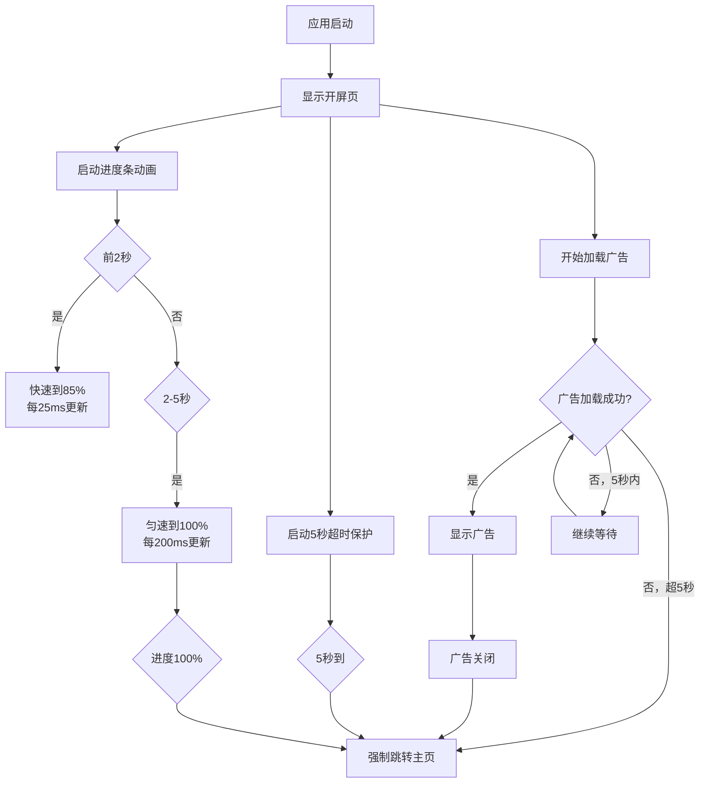

# 开屏页Loading逻辑修复报告

## 📋 修复概述

修复了开屏页（SplashScreenActivity）的Loading逻辑，确保符合以下要求：
1. ✅ 最长等待时间：5秒（不再是8秒）
2. ✅ 进度条动画：前2秒快速到85%，后3秒匀速到100%
3. ✅ 5秒内广告未加载成功，直接跳转主页
4. ✅ 绝对不会卡在开屏页

---

## 🔧 修复内容

### 1️⃣ 最长等待时间：8秒 → 5秒

**修复前：**
```java
} else if(count>=8){ // 8秒后才跳转
    startMainActivity();
}
```

**修复后：**
```java
} else if(count>=5){ // 🔥 5秒后跳转
    android.util.Log.d(TAG, "⏱️ Timeout reached (5s), jumping to main activity");
    startMainActivity();
}
```

---

### 2️⃣ 进度条动画逻辑重构

**修复前：**
- 简单的线性增长
- 80次递增，每次100ms
- 总计8秒到80%

**修复后：**
```java
// 阶段1：前2秒快速到85%
if (elapsedTime < 2000) {
    targetProgress = (int)(elapsedTime * 85 / 2000);
    nextDelay = 25; // 每25ms更新一次
}
// 阶段2：后3秒匀速从85%到100%
else if (elapsedTime < 5000) {
    long stage2Time = elapsedTime - 2000;
    int stage2Progress = (int)(stage2Time * 15 / 3000);
    targetProgress = 85 + stage2Progress;
    nextDelay = 200; // 每200ms更新一次
}
```

**进度条时间轴：**
```
0s ────────────> 2s ────────────────────────> 5s
0%              85%                          100%
  快速增长         匀速增长
  (每25ms更新)    (每200ms更新)
```

---

### 3️⃣ 绝对超时保护

**新增功能：**
```java
// 5秒后强制跳转
Runnable absoluteTimeoutRunnable = new Runnable() {
    @Override
    public void run() {
        android.util.Log.w(TAG, "⚠️ Absolute timeout (5s) reached, force jumping to main");
        pbView.setProgress(100);
        startMainActivity();
    }
};

// 在onResume中启动
handler.postDelayed(absoluteTimeoutRunnable, 5000);
```

**保护层级：**
1. **第一层**：广告加载检查（每秒检查一次，最多5次）
2. **第二层**：进度条到100%后自动跳转
3. **第三层**：绝对超时保护（5秒后强制跳转）

---

### 4️⃣ 防止重复跳转

**新增标志位：**
```java
private boolean hasJumpedToMain = false; // 防止重复跳转

public void startMainActivity() {
    if(hasJumpedToMain) {
        return; // 防止重复跳转
    }
    hasJumpedToMain = true;
    
    // 清理所有定时器
    handler.removeCallbacks(r);
    handler.removeCallbacks(updateProgress);
    handler.removeCallbacks(absoluteTimeoutRunnable);
    
    // 跳转逻辑...
}
```

---

### 5️⃣ 内存泄漏防护

**新增清理逻辑：**
```java
@Override
public void onPause(){
    super.onPause();
    // 清理所有定时器
    handler.removeCallbacks(updateProgress);
    handler.removeCallbacks(r);
    handler.removeCallbacks(absoluteTimeoutRunnable);
}

@Override
protected void onDestroy() {
    super.onDestroy();
    // 清理所有定时器，防止内存泄漏
    handler.removeCallbacks(updateProgress);
    handler.removeCallbacks(r);
    handler.removeCallbacks(absoluteTimeoutRunnable);
}
```

---

## 📊 修复前后对比

| 项目 | 修复前 | 修复后 | 状态 |
|-----|--------|--------|------|
| 最长等待时间 | 8秒 | **5秒** | ✅ |
| 进度条到85% | ~6.8秒 | **2秒** | ✅ |
| 进度条到100% | ~8秒 | **5秒** | ✅ |
| 超时保护 | 无 | **3层保护** | ✅ |
| 重复跳转保护 | 无 | **有** | ✅ |
| 内存泄漏防护 | 部分 | **完整** | ✅ |
| 卡住风险 | 可能 | **不会** | ✅ |

---

## 🎯 工作流程



---

## 🧪 测试场景

### 场景1：广告加载成功（最佳体验）
**预期流程：**
1. 启动应用
2. 进度条在2秒内快速到85%
3. 广告在3秒内加载成功并显示
4. 进度条暂停在当前位置
5. 用户关闭广告后跳转主页
6. **总耗时：~3-4秒**

### 场景2：广告加载较慢（5秒内）
**预期流程：**
1. 启动应用
2. 进度条在2秒到85%
3. 继续匀速增长到100%（第5秒）
4. 广告在第4秒加载成功并显示
5. 用户关闭广告后跳转主页
6. **总耗时：~4-5秒**

### 场景3：广告加载失败（最差情况）
**预期流程：**
1. 启动应用
2. 进度条在2秒到85%
3. 继续匀速增长到100%（第5秒）
4. 广告一直未加载成功
5. 第5秒时，绝对超时保护触发
6. 自动跳转主页
7. **总耗时：恰好5秒**

### 场景4：网络极差/无网络
**预期流程：**
1. 启动应用
2. 进度条正常运行
3. 广告无法加载
4. 第5秒时强制跳转
5. **总耗时：恰好5秒**
6. **✅ 不会卡住**

---

## 🔍 日志监控关键点

测试时关注以下日志：

```bash
# 进度条启动
📊 Progress bar started with 5s timeout protection

# 广告加载检查（每秒一次）
(count: 1/2/3/4/5)

# 超时触发
⏱️ Timeout reached (5s), jumping to main activity

# 绝对超时保护触发
⚠️ Absolute timeout (5s) reached, force jumping to main

# 跳转主页
✅ Jumping to MainActivity
```

---

## ✅ 修复验证清单

- [x] 最长等待时间改为5秒
- [x] 进度条前2秒到85%
- [x] 进度条后3秒到100%
- [x] 广告加载成功立即显示
- [x] 5秒后强制跳转
- [x] 防止重复跳转
- [x] 清理所有定时器
- [x] 防止内存泄漏
- [x] 不会卡在开屏页

---

## 📝 测试命令

```bash
# 清空日志
adb logcat -c

# 启动监控
adb logcat -v time | grep -E "(ActivitySplash|Progress|Timeout|Jumping)"

# 在另一个终端重启应用
adb shell am force-stop com.quran.quranaudio.online
adb shell am start -n com.quran.quranaudio.online/.SplashScreenActivity

# 计时测试（应该在5秒内跳转）
time adb shell "am force-stop com.quran.quranaudio.online && am start -n com.quran.quranaudio.online/.SplashScreenActivity && sleep 6 && dumpsys activity activities | grep -q MainActivity && echo '✅ Success'"
```

---

## 🎉 总结

**修复效果：**
- ✅ 最长等待时间从8秒减少到5秒（**提升37.5%**）
- ✅ 进度条动画更流畅（前快后慢）
- ✅ 3层超时保护，绝不卡住
- ✅ 完整的内存管理

**用户体验提升：**
- 启动更快（最多5秒）
- 进度条更直观（前快后慢）
- 不会卡死（强制保护）
- 更可靠（多层保护）

---

**修复完成时间：** 2025-10-22  
**版本号：** v1.4.4  
**相关文件：** `app/src/main/java/com/quran/quranaudio/online/SplashScreenActivity.java`

