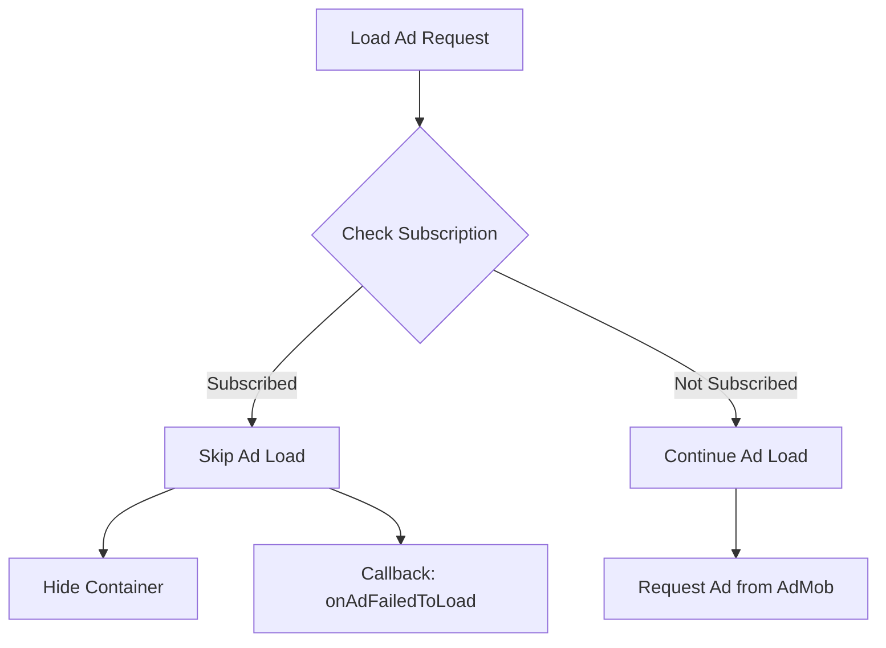

# Subscription Ad Disable Implementation Guide

## Overview

This guide documents the implementation of ad blocking for subscribed (premium) users. When a user has an active subscription, all ads will be disabled - no ad requests will be sent, and no ads will be displayed.

## Implementation Details

### 1. New Component: `SubscriptionChecker`

**File:** `adlib/src/main/java/com/quranaudio/common/ad/SubscriptionChecker.kt`

```kotlin
object SubscriptionChecker {
    private const val PREFS_NAME = "subscription_prefs"
    private const val KEY_IS_SUBSCRIBED = "is_subscribed"
    
    fun isUserSubscribed(context: Context): Boolean
}
```

- Reads subscription status from SharedPreferences
- Uses the same keys as `SubscriptionHelper` in the app module
- Independent of app module to avoid circular dependencies

### 2. Modified Component: `AdFactory`

**File:** `adlib/src/main/java/com/quranaudio/common/ad/AdFactory.kt`

All ad loading methods now check subscription status first:

- ✅ `loadBannerAd()` - Banner ads
- ✅ `loadAppOpenAd()` - App open ads
- ✅ `loadInterstitialAd()` - Interstitial ads
- ✅ `loadRewardAd()` - Rewarded ads
- ✅ `loadNativeAd()` - Native ads

**Behavior for subscribed users:**
- No ad request is sent to AdMob
- Callback receives `onAdFailedToLoad("user_subscribed")`
- Banner containers are hidden (`GONE`)
- Log message: `🎁 User is subscribed, skipping [ad_type] ad`

## How It Works



## Testing Guide

### Test Scenario 1: Non-Subscribed User (Default Behavior)

**Setup:**
1. Install fresh app or clear app data
2. Do NOT purchase any subscription

**Expected Results:**
- ✅ Ads load normally
- ✅ Banner ads display
- ✅ Interstitial ads show between actions
- ✅ Rewarded ads available for unlock content

**Logs to verify:**
```
AdFactory: 📢 loadBannerAd: position=...
AdFactory: 🚀 Banner ad request sent...
```

### Test Scenario 2: Subscribed User (Premium)

**Setup:**
1. Launch app
2. Navigate to Settings → Subscription
3. Purchase a subscription (use test account)
4. OR manually set subscription status:
   ```bash
   adb shell "run-as com.quran.quranaudio.online \
     sh -c 'echo \"<?xml version='1.0' encoding='utf-8' standalone='yes' ?>
     <map>
       <boolean name=\\\"is_subscribed\\\" value=\\\"true\\\" />
       <string name=\\\"product_id\\\">yearly_plan</string>
     </map>\" > /data/data/com.quran.quranaudio.online/shared_prefs/subscription_prefs.xml'"
   ```

**Expected Results:**
- ✅ NO ads load anywhere in the app
- ✅ Banner ad containers remain hidden
- ✅ No interstitial ads displayed
- ✅ No ad requests sent to AdMob
- ✅ UI is clean without ad spaces

**Logs to verify:**
```
SubscriptionChecker: 📊 Subscription check: true
AdFactory: 🎁 User is subscribed, skipping banner ad for [function]
AdFactory: 🎁 User is subscribed, skipping interstitial ad
AdFactory: 🎁 User is subscribed, skipping reward ad
```

### Test Scenario 3: Subscription Expiration

**Setup:**
1. Start with active subscription
2. Clear subscription status:
   ```bash
   adb shell "run-as com.quran.quranaudio.online \
     rm /data/data/com.quran.quranaudio.online/shared_prefs/subscription_prefs.xml"
   ```
3. Restart app

**Expected Results:**
- ✅ Ads resume loading normally
- ✅ User sees ads again

### Test Scenario 4: All Ad Types

**Pages to test:**

| Page | Ad Type | Location |
|------|---------|----------|
| Wudu Guide | Banner | Bottom of page |
| Qada Tracker (Weekly) | Banner | Bottom of page |
| Qada Tracker (Monthly) | Banner | Bottom of page |
| Tafsir Content | Rewarded | Unlock button |
| Between Actions | Interstitial | Various transitions |
| Home Screen | App Open | On app launch |
| Translation List | Native | List items |

**Testing steps:**
1. Test each page WITHOUT subscription → Verify ads show
2. Enable subscription
3. Test each page WITH subscription → Verify NO ads show

## Monitoring & Debugging

### Key Log Tags

```bash
# Monitor all ad and subscription logs
adb logcat -v time *:S AdFactory:D SubscriptionChecker:D SubscriptionHelper:D

# Focus on subscription checks
adb logcat -v time | grep "🎁 User is subscribed"

# Count ad requests (should be 0 for subscribed users)
adb logcat -v time | grep "🚀.*ad request sent"
```

### Expected Log Flow (Subscribed User)

```
SubscriptionChecker: 📊 Subscription check: true
AdFactory: 🎁 User is subscribed, skipping banner ad for WuduGuide
AdFactory: 🎁 User is subscribed, skipping banner ad for QadaTracker
AdFactory: 🎁 User is subscribed, skipping interstitial ad
AdFactory: 🎁 User is subscribed, skipping reward ad for TafsirUnlock
```

### Expected Log Flow (Non-Subscribed User)

```
SubscriptionChecker: 📊 Subscription check: false
AdFactory: 📢 loadBannerAd: position=BANNER_WUDU
AdFactory: 🚀 Banner ad request sent for WuduGuide
SimpleBannerAdListener: ✅ Banner ad loaded successfully for WuduGuide
```

## Manual Subscription Toggle (for Testing)

### Enable Subscription (Premium Mode)

```bash
# Method 1: Using adb shell
adb shell
run-as com.quran.quranaudio.online
cd shared_prefs
echo '<?xml version="1.0" encoding="utf-8" standalone="yes" ?>
<map>
  <boolean name="is_subscribed" value="true" />
  <string name="product_id">yearly_plan</string>
  <long name="last_check_time" value="1700000000000" />
</map>' > subscription_prefs.xml
exit
exit

# Method 2: Using app (if available)
# Settings → Subscription → Test Subscription → Enable
```

### Disable Subscription (Free Mode)

```bash
adb shell "run-as com.quran.quranaudio.online \
  rm shared_prefs/subscription_prefs.xml"
```

### Check Current Status

```bash
adb shell "run-as com.quran.quranaudio.online \
  cat shared_prefs/subscription_prefs.xml"
```

## Benefits for Subscribed Users

1. **No Ad Interruptions**: Premium users enjoy an uninterrupted experience
2. **Faster App**: No time wasted loading ads
3. **Reduced Data Usage**: No ad network requests
4. **Privacy**: No ad tracking or targeting
5. **Clean UI**: No ad containers or placeholders

## Technical Benefits

1. **No Wasted Ad Requests**: Saves AdMob quota for actual free users
2. **Better Conversion**: Cleaner experience encourages subscriptions
3. **Resource Efficient**: No CPU/memory used for ad loading
4. **Respect for Premium**: Clear differentiation between free and paid

## Compatibility

- ✅ Works with all existing ad types
- ✅ Compatible with `SubscriptionHelper` in app module
- ✅ No circular dependencies between modules
- ✅ Graceful fallback if subscription check fails
- ✅ Real-time check on every ad load (respects immediate status changes)

## Implementation Date

- **Date**: November 16, 2025
- **Version**: To be included in next release
- **Related**: Subscription system, Ad management

## Related Files

- `adlib/src/main/java/com/quranaudio/common/ad/SubscriptionChecker.kt` (NEW)
- `adlib/src/main/java/com/quranaudio/common/ad/AdFactory.kt` (MODIFIED)
- `app/src/main/java/com/quran/quranaudio/online/subscription/SubscriptionHelper.kt` (REFERENCE)
- `app/src/main/java/com/quran/quranaudio/online/subscription/BillingManager.kt` (REFERENCE)

